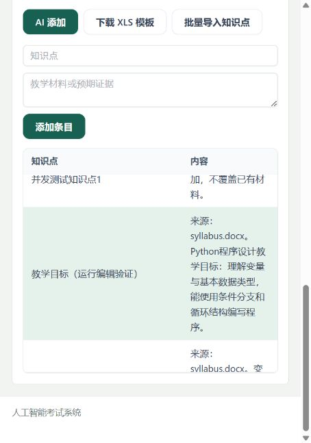

# AI 知识库运行测试

测试日期：2026-10-02。启动独立的 Spring Boot 实例（8081）和 Vite 前端（3000），使用临时 SQLite 数据库、测试教师/学生会话与临时编写的教学材料，不修改已有业务数据。

## 真实模型配置检查

项目配置的 `deepseek-v4-flash` 不在服务商 `/models` 返回的模型列表中。真实生成请求返回 HTTP 503；最小模型请求确认服务商错误码为 `model_not_found`。

仅在临时测试环境中将模型切换为服务商列出的 `deepseek-flash`，继续真实模型运行验证。项目原 `.env` 未修改。

## HTTP 和数据库结果

12 项运行检查全部通过：

1. 教师 JWT 会话鉴权。
2. 通过 HTTP 创建知识库。
3. 同时上传 DOCX、PPTX、XLSX、TXT、PDF 五种材料并调用真实模型；最终测试耗时 7.23 秒，生成 6 条知识点。
4. 知识点与内容满足数据库字段长度限制。
5. 批量入库返回导入数 6。
6. SQLite 中核对 6 条记录确已持久化。
7. 通过 HTTP 重新读取已入库记录。
8. 无效批次返回 400，数据库条目数不变。
9. 学生访问写入接口被拒绝；运行实例最终返回 401。
10. 缺失 CSRF 的写入被拒绝；运行实例最终返回 401。
11. PNG 等不支持的格式返回 400 和明确格式提示。
12. 两个会话并发追加均返回 200；条目数由 6 增至 8，原记录保留。

## 浏览器结果

在真实知识库页面中上传 DOCX/PPTX，生成 9 条预览；编辑第一条标题为“教学目标（运行编辑验证）”，移除最后一条，点击一键入库。页面显示“已添加 8 条知识点”，列表自动刷新。

最终 SQLite 数据库中共有 16 条记录，编辑后的条目已持久化；当前测试知识库记录了 4 次 AI 入库审计（首次批量、两次并发追加、浏览器入库）。

测试结束后关闭临时服务并删除临时复制的模型配置文件。运行测试没有修改应用代码，也没有覆盖其他会话的改动。
